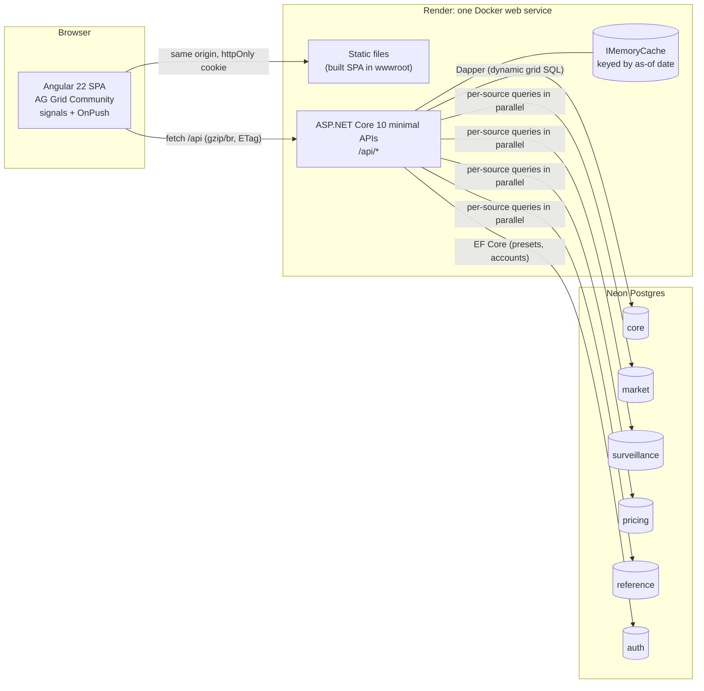

# Credit Desk Analytics

Front-office analytics for a **structured-credit trading desk**. Very large position grids (large in rows **and** columns), fund performance over user-chosen ranges, multi-source "insight boards" of many small grids, and deal exploration. Built end to end on **.NET 10 + Postgres + Angular**, and tuned at every layer for data loading and rendering.

> **This README is the implementation spec.** A coding agent (or a person) must be able to build the whole system from this file plus [`AGENTS.md`](AGENTS.md) (working rules) and [`docs/adr/`](docs/adr/) (decision records written as the work proceeds). Where this spec says **MUST**, it's an acceptance criterion; **SHOULD** is a strong default that may be overridden by an ADR with measurements.

---

## Contents

1. [Purpose and context](#1-purpose-and-context)
2. [Architecture](#2-architecture)
3. [Tech stack](#3-tech-stack)
4. [Repository layout](#4-repository-layout)
5. [Data model and seed data](#5-data-model-and-seed-data)
6. [Pages and scenarios](#6-pages-and-scenarios)
7. [Security, accounts and resource protection](#7-security-accounts-and-resource-protection)
8. [Backend requirements](#8-backend-requirements)
9. [Frontend requirements and trade-desk UI](#9-frontend-requirements-and-trade-desk-ui)
10. [Performance budgets and how they're measured](#10-performance-budgets-and-how-theyre-measured)
11. [Testing](#11-testing)
12. [Local development](#12-local-development)
13. [Deployment: Render + Neon](#13-deployment-render--neon)
14. [CI](#14-ci)
15. [Delivery plan: one PR per phase](#15-delivery-plan-one-pr-per-phase)
16. [Out of scope / later](#16-out-of-scope--later)
17. [Status](#17-status)

---

## 1. Purpose and context

### The users and their day

- **About 60 internal users:** portfolio managers, traders and analysts on one structured-credit desk (CLO, RMBS, CMBS, ABS, CRT). It isn't public-facing, and there are no external investors.
- **Overnight batch:**
  - Pricing and risk jobs run overnight and finish at about **06:30 ET**.
  - From then until the next batch the data is **static**: no intraday ticks, except the optional stretch overlay in P6.
  - Users arrive at about 07:30 and open their start-of-day screens.
- **They live in Excel, and they want the app to behave like Excel:**
  - Every row, every column, scroll anywhere.
  - Sort, filter, totals that always reflect the current filter.
  - Copy and paste, export.
- **Priorities:**
  1. **Correct numbers.** Silent errors are the worst kind.
  2. **Speed.**
  3. Look and feel. Dashboards and interactivity matter more and more, but they come third.
- **Delivery cadence:** weekly, sometimes twice a week. Every feature ships as a small, reviewable PR.

### What "fast" means here (the targets behind §10)

| Moment | Target (warm instance) |
|---|---|
| Open the start-of-day grid (20,000 × 200) and see the first rows | **< 1.0 s** |
| Scroll anywhere (vertical and horizontal) | 60 fps, no blank rows longer than 150 ms |
| Change sort or filter | New first block **< 400 ms**, and the summary row updates in the same response |
| Switch fund-performance range | **< 300 ms** |
| Insight board (20 grids, 5 sources) | The first tile paints < 500 ms, all tiles < 1.5 s, and one slow source never blocks the others |

### The engineering story this repo tells

Every layer is a deliberate, **measured** decision, recorded as an ADR in the PR that made it:

- **Database:** a wide snapshot for "today", narrow history for trends, the right indexes, and a correct aggregation grain.
- **Data access:** **Dapper** where the result shape is dynamic (the grid), and **EF Core** where the model is stable (presets, accounts, config). DbContext lifetime, tracking and concurrency are handled correctly.
- **API and DTOs:** send only what the screen needs (the visible row block × the displayed columns), in a columnar shape. Totals over **all** filtered rows ride in the same response. Overnight data is cached until the next batch.
- **Angular:** AG Grid Community **Infinite Row Model** + column virtualization; signals + OnPush; `switchMap` so stale responses never win; progressive rendering for multi-source pages.

---

## 2. Architecture



**Key decisions (each one gets an ADR, see §15):**

- **One Render web service** serves the built SPA **and** the API from the same origin.
  - **Why:** the invite-only login uses **same-origin httpOnly `SameSite=Strict` cookies**: no CORS, no third-party-cookie problems, no tokens in JavaScript. It also means only one free instance to keep inside platform limits.
  - **Rejected:** a Render static site plus a separate API service. (GitHub Pages is out too: it needs a paid plan for a private repo and can't run the API.)
- **Neon Postgres** in production and **Postgres 17 in Docker** locally: one SQL dialect everywhere.
- **Five logical data sources** (`core`, `market`, `surveillance`, `pricing`, `reference`), each with **its own connection-string setting**.
  - They live in one Neon database today, as separate schemas.
  - Any of them can move to another database without code changes, which makes the "several data sources on one page" scenario real.
- **Cache-first reads:** the data changes once a day, so every grid/aggregate response is cached in-process until the next as-of date and served with an `ETag`. This protects the free-tier database as much as it speeds up the UI.

---

## 3. Tech stack

Pinned majors. Minors and patches are kept current.

| Layer | Choice | Notes |
|---|---|---|
| Runtime | **.NET 10** (LTS) | ASP.NET Core **minimal APIs** |
| Data access, dynamic | **Dapper** 2.x + **Npgsql** | Grid queries whose column set, sort and filter are chosen per user at runtime |
| Data access, stable model | **EF Core 10 + Npgsql provider** | Accounts (ASP.NET Core Identity), presets, audit, seed metadata, **migrations** |
| Database | **Postgres 17** (Neon in production) | Schemas per data source; `COPY` for bulk load |
| Frontend | **Angular 22** | Standalone components, **signals**, **OnPush**, zoneless change detection, new control flow (`@if`/`@for`) |
| Reactive | **RxJS 7.8** | `switchMap`/`debounceTime` for query streams; bridged to signals with `toSignal` |
| Grid | **AG Grid Community 36** | **Infinite Row Model**, column virtualization, pinned rows and columns. **No Enterprise features** (no SSRM, server pivot UI, or Excel export) |
| Serialization | System.Text.Json (columnar DTO); **MessagePack** as an optional `Accept` variant | Chosen by measurement (ADR-0007) |
| Tests | **xUnit** + **Testcontainers** (Postgres), **Vitest** (Angular), **Playwright** (e2e + screenshots) | |
| Load/perf | **k6** (API), Playwright traces + the Performance API (UI), a Node payload-size script | |
| Local | **Docker Compose** | `postgres`, `app` |
| Hosting | **Render** (Docker web service) + **Neon** (Postgres) | Free tier first; upgrade paths documented |

---

## 4. Repository layout

```
credit-desk-analytics/
├─ README.md                 ← this spec (+ §17 Status table, updated by every PR)
├─ AGENTS.md                 ← working rules for the implementing agent
├─ CLAUDE.md                 ← pointer to AGENTS.md
├─ docs/
│  ├─ adr/                   ← architecture decision records (template + index)
│  └─ screenshots/           ← Playwright screenshots referenced from PRs
├─ src/
│  ├─ Desk.Api/              ← ASP.NET Core 10: endpoints, auth, rate limiting, caching, serves SPA from wwwroot
│  ├─ Desk.Data/             ← EF Core DbContexts + migrations; Dapper query builders; source registry
│  ├─ Desk.Seeder/           ← deterministic synthetic data generator (console), bulk COPY
│  └─ Desk.UserAdmin/        ← CLI: add/list/disable/reset accounts (prints a generated password once)
├─ tests/
│  ├─ Desk.Api.Tests/        ← integration tests on Testcontainers Postgres
│  ├─ Desk.Data.Tests/       ← query-builder and whitelist unit tests (phase 3)
│  └─ Desk.Seeder.Tests/     ← generator unit tests + Testcontainers seeding tests
├─ web/                      ← Angular 22 workspace (app + Vitest unit tests)
├─ e2e/                      ← Playwright tests + screenshot specs
├─ perf/                     ← LoadBenchmark (ADR-0004), k6 scripts, payload-size script
├─ deploy/
│  ├─ Dockerfile             ← multi-stage: node build web → dotnet publish → runtime image
│  └─ start.sh               ← env check → exec app (no migrations at boot)
├─ render.yaml               ← Render Blueprint (one service, autoDeploy off)
├─ docker-compose.yml
├─ .env.example              ← key names only, never values
└─ .github/
   ├─ workflows/             ← ci.yml (api, web, e2e, budgets), deploy.yml (migrate → seed → deploy → smoke), db-ops.yml
   └─ pull_request_template.md
```

---

## 5. Data model and seed data

All data is **synthetic** and generated **deterministically** (`SEED=42` by default, so the same seed always gives the same database). It must look and behave like real structured-credit desk data: realistic names, distributions, correlations, NULLs where real data has NULLs, and a few deliberate edge cases.

### 5.1 Schemas (= data sources)

| Schema / source | Contents | Connection setting |
|---|---|---|
| `core` | deals, bonds (tranches), portfolios, funds, positions (wide snapshot + narrow history), trades, fund performance | `ConnectionStrings__Core` |
| `market` | rates curves (UST/SOFR swap), credit-spread indices by sector × rating, daily marks history | `ConnectionStrings__Market` |
| `surveillance` | monthly remittance / loan-tape **aggregates** per deal: delinquency buckets, CPR/CDR/severity, WAC, WALA, LTV/FICO bands, OC/IC test results | `ConnectionStrings__Surveillance` |
| `pricing` | vendor marks (three synthetic vendors) vs internal marks per bond per day; challenge flags | `ConnectionStrings__Pricing` |
| `reference` | issuers, servicers, trustees, rating scales, sector taxonomy, holiday calendar | `ConnectionStrings__Reference` |
| `auth` / `app` | Identity tables, user presets, audit log, seed metadata | `ConnectionStrings__App` |

In production all six settings point at the same Neon database (`DATABASE_URL`) unless overridden. The code **MUST** resolve a connection per source through a single `IDataSourceRegistry` (one `NpgsqlDataSource` per distinct connection string).

### 5.2 Core tables

| Table | Rows (seed) | Shape |
|---|---|---|
| `core.fund` | 4 | id, name, inception_date, strategy |
| `core.portfolio` | 12 | id, fund_id, name, manager, benchmark |
| `core.deal` | ~1,500 | deal_id, name (e.g. `CLO 2024-3`), sector (CLO/RMBS/CMBS/ABS/CRT), sub_sector, issuer_id, servicer_id, trustee_id, vintage (year), closing_date, collateral_type, original_balance `numeric(18,2)`, currency, status |
| `core.bond` | ~9,000 | bond_id, deal_id, cusip (synthetic, valid check digit), class (A1/A2/B/C/D/E/…), seniority_rank, original_balance, current_balance, factor, coupon_type (FIXED/FLOAT), coupon_or_margin, index (SOFR/none), rating_sp/moodys/fitch, legal_final, expected_maturity |
| `core.position_snapshot` | **20,000 per as-of date**, **2 as-of dates** (today and the prior business day) | **wide, about 200 columns**, see 5.3 |
| `core.position_history` | about 24 month-ends × 20,000 | **narrow**: as_of_date, position_id, market_value, face, price, spread, dv01, cs01, wal, pnl_mtd |
| `core.trade` | ~150,000 over 2 years | trade_id, bond_id, portfolio_id, trade_ts `timestamptz` (realistic intraday times), side, face, price, counterparty_id, trader |
| `core.fund_performance` | about 40–70 months per fund (from each fund's inception through the month before as-of) | fund_id, as_of_month (month-end `date`), nav `numeric(18,2)`, balance, irr_itd, irr_ytd, net_flows |

**Deliberate edge cases the seed MUST include** (tests depend on them):
- at least **3 deals with zero bonds** (newly announced, pricing pending)
- deals with exactly 1 bond
- bonds with **NULL coupon** (residual/equity tranches)
- positions with **zero face** (fully paid down)
- trades at **23:59:59.xxx** on month-ends
- a fund whose inception is mid-month
- duplicate dates in a cash-flow series (for window-frame tests)

### 5.3 The wide position snapshot (about 200 columns)

One row per (as_of_date, position_id). Column groups, all `double precision` except money (`numeric(18,2)`) and identifiers or text:

| Group | Columns (count) |
|---|---|
| Keys and identity | as_of_date, position_id, portfolio_id, fund_id, bond_id, deal_id, cusip, deal_name, class, sector, sub_sector, vintage, rating_composite, currency (14) |
| Holding | face, current_face, factor, book_price, book_value, market_value, accrued, unrealized_pnl, pct_of_portfolio_mv (9) |
| Pricing | price, price_chg_1d, yield, spread_bp, oas_bp, dm_bp, z_spread_bp, price_source, vendor_dispersion_bp (9) |
| Rate risk | mod_duration, eff_duration, convexity, dv01, key_rate_dv01 at 2y/5y/10y/20y/30y (9) |
| Credit risk | spread_duration, cs01, jtd (jump-to-default), expected_loss_pct, attachment_pct, detachment_pct, credit_enhancement_pct (7) |
| Cash flow | wal, window_start, window_end, next_pay_date, coupon_current, coupon_next (6) |
| Collateral performance | cpr_1m/3m/12m, cdr_1m/3m/12m, severity_3m/12m, dq_30, dq_60, dq_90plus, foreclosure_pct, reo_pct, wac, wala, ltv_wavg, fico_wavg (18) |
| Deal tests | oc_test_cushion, ic_test_cushion, warf, diversity_score, ccc_bucket_pct (5) |
| P&L attribution (MTD) | carry, roll_down, rates_pnl, spread_pnl, idiosyncratic_pnl, fx_pnl, residual_pnl (7) |
| **Scenario grid** | `scn_r{-200,-100,-50,-25,0,+25,+50,+100,+200,+300}_s{-100,-50,-25,0,+25,+50,+100,+200,+300,+500}` → **price under rate × spread shock, 10 × 10 = 100 columns** |
| Stress summaries | worst_case_price, best_case_price, scenario_range, stress_loss_mv (4) |
| Flags and text | watchlist_flag, restricted_flag, comment_count, last_trade_date, analyst (5) |

That's about **193 columns.** Pad with additional, clearly named analytics to reach ≥ 200 if needed. The **column catalog** (name, group, type, display format, aggregation: sum / wavg-by-market-value / none) **MUST** be data (`app.column_catalog`), seeded alongside the table. The API whitelist and the UI column definitions are both generated from it.

### 5.4 Size budget (Neon free tier: 0.5 GB storage per project at the time of writing; check the current limits)

| Object | Arithmetic | Estimate |
|---|---|---|
| position_snapshot | 2 dates × 20,000 rows × ~1.9 KB/row | ~76 MB (+ PK and 2 indexes ≈ 10 MB) |
| position_history | 24 × 20,000 rows × ~110 B | ~53 MB (+ index ≈ 15 MB) |
| trade | 150,000 × ~100 B | ~15 MB (+ indexes ≈ 8 MB) |
| surveillance / pricing / market | ~60 MB total | ~60 MB |
| deal, bond, reference, app | small | < 10 MB |
| **Total** | | **≈ 250 MB, which MUST stay < 350 MB** |

The seeder **MUST** print the final size (`pg_database_size`) and **fail** above 400 MB **before commit**, then roll back so the previous data and `app.seed_metadata` stay untouched. A later `--if-changed` skip must not fail the deploy just because a previous over-budget row is still in the database.

**Later reseeds peak at about 2×.** `TRUNCATE` inside a transaction keeps the old relfilenodes until `COMMIT`, so a `--force` (or SeedVersion bump) at scale 1.0 temporarily needs ~old + new. The seeder prints `SEED_PEAK_EST_MB` before it truncates. Neon Free has been documented as both 0.5 GB (this spec's planning number) and 1 GB; confirm the project's cap before a production reseed. The first deploy after this PR starts from empty phase-1 tables, so the peak is about the committed size (~271 MB) plus WAL.

**Measured (phase 1, scale 1.0, SEED=42, Postgres 17, linux-x64):**
- **1,563,791 rows** across 20 tables.
- First `--if-changed` on an empty migrated DB: `DB_SIZE_MB=270`, `ELAPSED_S=11.1` (generate+load 10.5 s).
- Forced reseed: `DB_SIZE_MB=271`, `ELAPSED_S=11.5`; peak `pg_database_size` during the transaction **533.8 MB**.
- The snapshot is **202 columns**.
- The total book is about $6.9B market value across 20,001 positions.

See ADR-0003 and ADR-0004.

### 5.5 Seeder requirements

- A .NET console app (`src/Desk.Seeder`). Options:
  - `--seed` (default 42)
  - `--as-of yyyy-MM-dd` (default: the last business day)
  - `--scale` (0.1 for tests, 1.0 default)
  - **exactly one mode is required** (no mode exits 1, because a reseed truncates every seeded table):
    - `--if-changed`: skip when the version, seed and scale match `app.seed_metadata` (what the deploy pipeline uses)
    - `--force`: always reseed (`db-ops` reseed)
    - `--size-report`
  - `--max-mb`
- The prior business day is generated as the snapshot's second as-of date.
- **Cancellation (Ctrl+C or a CI timeout) rolls back the single seeding transaction,** leaving the previous data intact. Exit code 130.
- **Each table draws from its own RNG stream** (xoshiro256**, pinned by a test), so adding rows to one table never shifts another table's values.
- **Bulk load via Npgsql binary `COPY`** (`BeginBinaryImport`). EF `AddRange` is only for small tables. ADR-0004 **MUST** include the measured comparison of the two for the snapshot table.
- **Idempotent:** writes a row to `app.seed_metadata` (seed, scale, version, completed_at). If that row matches, skip.
- **Realism:**
  - Correlated draws: spread ~ rating × sector × vintage; price ~ spread × duration; delinquencies ~ vintage × sector.
  - Positions are drawn from bonds with a realistic concentration (some portfolios hold 3,000+ lines).
  - Scenario prices are generated from duration, convexity and spread duration, so they're internally consistent.
  - Names are plausible but fictional. **No real issuer, servicer or company names.**
- **Runs in < 90 s** at scale 1.0 against local Postgres, and < 5 min against Neon.

---

## 6. Pages and scenarios

Every page lists: **user story**, **API contract**, **SQL approach**, **front-end approach**, **acceptance criteria**, **budget**. All endpoints require authentication (§7) and live under `/api`.

### P1. Start-of-day Positions (20,000 rows × ~200 columns)

**User story:** *"At 07:30 I open my portfolio and see every position with every measure, like a spreadsheet. I scroll anywhere, sort and filter instantly, and the totals at the bottom always reflect what's filtered."*

**Front end:**
- AG Grid Community, `rowModelType: 'infinite'`, `cacheBlockSize: 200`, `maxBlocksInCache: 50`, `blockLoadDebounceMillis: 100`.
- **Column virtualization on** (the default; never disable it).
- `getRowId` = position_id.
- Pinned left: deal_name, class, cusip. A pinned **bottom summary row**.
- **Column presets:** per-user saved column state (order, width, visibility, pinned, sort, filters), loaded before the first request. Several named presets per user ("Risk", "Surveillance", "Scenarios", "All").
- **Only the displayed columns are requested.** When the displayed column set changes (show/hide or preset switch), purge the infinite cache and re-request. For horizontal scrolling inside the displayed set, no request is needed.
- **Quick filter box:** debounced at 300 ms, with `distinctUntilChanged` + `switchMap`, so a stale request is cancelled and can never overwrite a newer one.
- **CSV export** (Community) of the current filter and displayed columns, streamed from the API, not the browser cache.
- A status bar showing visible/total rows, last request ms, and cache HIT/MISS.

**API:**

```http
POST /api/positions/query
Content-Type: application/json
Accept: application/json            (or application/x-msgpack, see ADR-0007)

{
  "asOf": "2026-10-07",
  "portfolioIds": [3, 7],
  "startRow": 0,
  "endRow": 200,
  "columns": ["deal_name","class","cusip","market_value","dv01","spread_bp", "..."],
  "sortModel": [{ "colId": "market_value", "sort": "desc" }],
  "filterModel": {
    "sector":     { "filterType": "set",    "values": ["CLO","RMBS"] },
    "spread_bp":  { "filterType": "number", "type": "greaterThan", "filter": 250 },
    "deal_name":  { "filterType": "text",   "type": "contains",    "filter": "2024" }
  },
  "quickFilter": "clo 2024"
}
```

```jsonc
// 200 OK, ETag: "w/as-of-2026-10-07:sha1(query)", Server-Timing: db;dur=38, ser;dur=6, X-Cache: HIT|MISS
{
  "columns": ["position_id","deal_name","class","cusip","market_value","dv01","spread_bp"],
  "data": [[1,2,3,…],["CLO 2024-3",…],["A1",…],["…"],[1250000.00,…],[512.3,…],[145,…]], // data[col][row]
  "rowCount": 18342,                          // total rows matching the filter (drives the scrollbar)
  "summary": { "market_value": 8.12e9, "dv01": 3.4e6, "spread_bp": 212.4 }, // over ALL filtered rows
  "asOf": "2026-10-07",
  "generatedAt": "2026-10-07T11:02:13Z"
}
```

**Server rules:**
- **Whitelist:** column ids, sort ids and filter ids are resolved through the column catalog. Unknown ids are **dropped**, never concatenated into SQL. Every value is a parameter.
- `position_id` is always included (the row id) and always appended to `ORDER BY` as a **deterministic tie-breaker** (otherwise offset paging duplicates or skips rows).
- Block size is clamped to ≤ 500 rows, and displayed columns to ≤ 250.
- **One round trip:** the page query and the totals query (`COUNT(*)` + per-column aggregates from the catalog: SUM, or market-value-weighted average) are sent together (`QueryMultipleAsync` or a single batch).
- **Paging:** `OFFSET … FETCH` by default. ADR-0008 evaluates keyset paging, which the Infinite Row Model's random-access jumps make harder, and records the measured trade-off at deep offsets.
- **Caching:** the key is (as-of, canonicalized query JSON, user's portfolio entitlements). Entries live until the next as-of date. Support `If-None-Match` → **304**.
- The `CancellationToken` flows to Npgsql, so scrolling past a block cancels its query. The command timeout is 10 s.
- **Indexes:** `(as_of_date, portfolio_id)` + `INCLUDE` of the common key columns; plus partial or btree indexes for the top sort columns, chosen by `EXPLAIN (ANALYZE, BUFFERS)` evidence recorded in the PR.

**Acceptance criteria:**
- [ ] With 18k+ rows matching, scrolling to the last row shows correct data, and the summary row equals a `SUM` computed independently in SQL (test).
- [ ] An injection attempt in `sortModel.colId`, `filterModel` keys or `columns` is dropped (test), with no 500.
- [ ] Changing the displayed columns re-requests with the new `columns` and nothing else.
- [ ] A second identical request returns `X-Cache: HIT`, and `If-None-Match` returns 304.
- [ ] Rapid typing in the quick filter results in **one** completed request (others cancelled), proven by a Playwright network assertion.

**Budget:**
- First block (200 rows × the "Risk" preset of about 40 columns) ≤ **60 KB** compressed.
- "All" preset (200 × 200) ≤ **250 KB** compressed.
- API p95 ≤ 150 ms warm (cache MISS) and ≤ 15 ms (HIT).
- First rows painted < 1.0 s warm.

### P2. Fund Performance (2 rows × N months)

**User story:** *"Show me my fund's balance and IRR month by month for QTD, YTD, last 12 months, since inception, or a custom range."*

**API:**

```http
GET /api/funds/{fundId}/performance?range=YTD            (QTD | YTD | 1Y | ITD | CUSTOM&from=2025-01-31&to=2026-09-30)
```

```jsonc
{
  "fundId": 2,
  "months": ["2026-01-31","2026-02-28","2026-03-31","…"],
  "rows": [
    { "label": "Balance", "format": "money0", "values": [100000000.00, 104000000.00, …] },
    { "label": "IRR",     "format": "pct2",   "values": [0.0500, 0.0620, …] }
  ]
}
```

- **SQL:** long format (`SELECT as_of_month, balance, irr_itd FROM core.fund_performance WHERE fund_id=@f AND as_of_month BETWEEN @from AND @to ORDER BY as_of_month`). The **pivot to columns happens at the edge** (C# or client). There's no dynamic SQL `PIVOT`; ADR-0011 records the measured or argued trade-off.
- **Server validation:** every `values` array has `months.length` entries, otherwise 500 with a logged invariant violation. A range with no data returns empty arrays, not an error.
- **Front end:**
  - Column defs are **built from `months`** in a `computed()`. The row label column is pinned. Month headers read `Jan 26`.
  - Range buttons, plus a date-range picker for CUSTOM.
  - `switchMap` cancels the in-flight request when the range changes.
  - A sparkline per row is optional.
- **Acceptance:**
  - [ ] QTD, YTD, 1Y and ITD give the right month counts on fixed seed data (test).
  - [ ] A fund with mid-month inception starts at its first month-end.
  - [ ] Flipping ranges quickly never shows a stale range.
- **Budget:** < 300 ms; payload < 5 KB.

### P3. Insights Board (20 small grids from 5 data sources)

**User story:** *"Give me one page that slices the book 20 ways (by sector, vintage, rating, servicer, delinquency bucket, vendor-price dispersion…) so I can spot patterns, the way I'd pivot raw data in Excel."*

**Grids, about 5 × 5 each, grouped by source:**

| Source | Grids (examples) |
|---|---|
| `core` (6) | MV by sector × rating; DV01 by sector × duration bucket; P&L attribution by portfolio; top 5 issuers by MV; concentration by vintage; watchlist by sector |
| `market` (3) | spread change 1W/1M by sector × rating; curve moves; spread percentile vs 2Y |
| `surveillance` (5) | 60+ DQ by sector × vintage; CPR/CDR by servicer; OC cushion buckets; WARF by CLO vintage; LTV/FICO bands |
| `pricing` (3) | vendor dispersion buckets; internal vs vendor by sector; challenged marks count |
| `reference` (3) | servicer exposure; trustee exposure; rating-agency split |

**API:** **one endpoint per source**, not per grid and not one per page:

```http
GET /api/insights/{source}?asOf=2026-10-07&portfolioIds=3,7
→ { "source": "surveillance", "grids": [ { "id": "dq60_sector_vintage", "title": "...", "columns": [...], "rows": [[...]], "format": {...} }, ... ] }
```

- Inside an endpoint, the source's group-by queries run **in parallel**, each with **its own connection / DbContext** (`IDbContextFactory<T>` or `NpgsqlDataSource.OpenConnectionAsync` per task). **Never share a DbContext across concurrent tasks.** A test **MUST** prove the shared-context version throws and the per-task version passes.
- Fan-out is capped by a `SemaphoreSlim` (configurable; default 4 per request) **and** the global DB concurrency limiter (§7).
- Results are cached per (source, as-of, portfolios).
- **Correct aggregation grain:** never sum a parent-level field after joining to children. Aggregate the child first. A test covers deal original balance by sector (the classic fan-out double count).

**Front end:**
- **Five independent streams**, one per source (`toObservable(inputs) → debounceTime → switchMap(http) → startWith(loading) → catchError(error tile)` → `toSignal`), so tiles render **progressively**.
- A slow source shows skeleton tiles while the others are already painted. A failing source shows an error tile with retry, and the rest of the page is unaffected.
- Tiles are lightweight tables (or minimal AG Grid instances; ADR to decide by measurement), laid out in a CSS grid: `repeat(auto-fill, minmax(320px, 1fr))`.
- A **"naive mode" toggle** (dev or admin only) fires 20 separate requests, for the Performance Lab comparison.

**Acceptance:**
- [ ] With an artificial 2 s delay injected into one source (a dev-only header), the other four render first (Playwright).
- [ ] One source returning 500 shows exactly that source's error tiles.
- [ ] Changing the as-of date cancels in-flight calls.

**Budget:** first tile < 500 ms; all < 1.5 s warm.

### P4. Deal Explorer

**User story:** *"Show me all deals, each with one representative bond, then drill into a deal's full capital structure."*

- **Every deal appears even with zero bonds.** Postgres equivalent of SQL Server `OUTER APPLY`:

  ```sql
  SELECT d.deal_id, d.name, d.sector, b.class, b.current_balance
  FROM core.deal d
  LEFT JOIN LATERAL (
      SELECT b.class, b.current_balance
      FROM core.bond b
      WHERE b.deal_id = d.deal_id
      ORDER BY b.seniority_rank, b.bond_id   -- "representative" = most senior, deterministic
      LIMIT 1) b ON true;
  ```

- ADR-0013 compares `LATERAL … LIMIT 1` with `ROW_NUMBER() … = 1` + `LEFT JOIN` using `EXPLAIN (ANALYZE, BUFFERS)`, with an index on `bond(deal_id, seniority_rank, bond_id)`.
- **Master/detail:** selecting a deal loads its tranches (capital structure stack chart + grid), its surveillance trend (12 months), and its positions across portfolios.
- **Acceptance:**
  - [ ] The seed's zero-bond deals appear with blank bond columns (test).
  - [ ] Deal-level totals don't double count (test).

### P5. Performance Lab (the demo page)

**User story:** *"Show, with live numbers, why the grid is built the way it is."*

**Toggles for the P1 query:**
- payload format: row-object JSON / columnar JSON / MessagePack
- block size: 100 / 200 / 500
- columns: displayed-only / all 200
- cache: on / off (admin only)
- compression: br / gzip / none (dev only)
- P3: naive 20 calls vs 5 per-source calls

**It displays, per run:**
- bytes on the wire (`PerformanceResourceTiming.encodedBodySize`) and decoded size
- TTFB, download time, `JSON.parse` / decode time, grid render time (a `performance.mark` around `setRowData`/block success)
- server `Server-Timing` breakdown (db, serialize), cache status

A results table keeps the last 20 runs, with a "copy as markdown" button so the numbers can go straight into a PR or ADR.

**Acceptance:** all toggles work, and the numbers come from real requests, not hard-coded.

### P6 (stretch). Intraday overlay

An SSE stream (`/api/marks/stream`) of simulated mark changes for a subset of bonds, merged onto the overnight snapshot in P1:
- Each event carries `(bond_id, seq, event_ts)`.
- The client ignores events whose `seq` is ≤ the last applied one, so a reconnect or restart never applies stale data.
- Changed cells flash, and totals refresh from the server periodically.

---

## 7. Security, accounts and resource protection

The **website is public** (anyone can reach the login page). The **data is not**: everything under `/api` except `/api/auth/login` and `/health` requires an authenticated session.

### 7.1 Accounts (invite-only)

- **ASP.NET Core Identity** on EF Core (Postgres, `auth` schema). **There is no registration endpoint.**
- **Roles:** `viewer` (all pages, read-only) and `admin` (plus the usage page, cache controls, naive-mode toggles).
- **Each account has an `ExpiresAt`;** login is refused after it. Reviewer accounts get short expiries.
- **Lockout:** 5 failed attempts gives a 15-minute lockout. Password policy is Identity defaults with a minimum length of 14.
- **Session:**
  - Same-origin cookie: `HttpOnly`, `Secure`, `SameSite=Strict`, 8 h sliding, absolute 24 h.
  - Antiforgery token on state-changing requests (presets save, admin actions).
  - The data-protection keys are persisted to the database, so sessions survive restarts.
- **User admin CLI** (`src/Desk.UserAdmin`):

  ```bash
  dotnet run --project src/Desk.UserAdmin -- add    --email reviewer@example.com --role viewer --expires 2026-11-30
  dotnet run --project src/Desk.UserAdmin -- list
  dotnet run --project src/Desk.UserAdmin -- disable --email reviewer@example.com
  dotnet run --project src/Desk.UserAdmin -- reset   --email reviewer@example.com
  ```

  It generates a strong random password, **prints it once** to stdout, stores only the hash, and **never logs it**. Against production it runs locally with `ConnectionStrings__App` pointed at Neon. Credentials are shared out of band and are **never** committed or put in issues or PRs.
- **Optional seeded demo accounts:** read from the `DEMO_ACCOUNTS_JSON` env var (secret, set in the Render dashboard). Absent means none.

### 7.2 Protecting the free tiers (Render instance hours, Neon compute and storage)

- **Rate limiting** (`AddRateLimiter`):
  - per user: token bucket, 60 requests/min, burst 20
  - per IP on `/api/auth/login`: 5/min
  - **global concurrency limiter** on DB-bound endpoints: 8 concurrent, queue 32, then 429 with `Retry-After`
- **Query guards:** command timeout 10 s; block ≤ 500 rows; ≤ 250 columns; CSV export ≤ 25,000 rows and 1 at a time per user.
- **Cache-first:** grid, aggregate and performance responses are cached until the next as-of date. A healthy demo session should hit Neon only on first views.
- **Kill switch:** `MAINTENANCE_MODE=true` makes every `/api` call return 503 with a friendly message **without touching the database**. The login page shows a banner.
- **Audit:** `app.audit` records (user, endpoint, rows returned, ms, cache status, timestamp) and logins (success and failure). Admin page **Usage** shows requests per user per day, cache hit ratio and slowest queries.
- **Health:** `/health` is static (never touches the DB, so platform probes don't wake Neon). `/health/db` does a real check and is admin-only.

### 7.3 Hardening

- Security headers:
  - **CSP:** `default-src 'self'`; no inline scripts; `style-src 'self' 'unsafe-inline'` only if AG Grid requires it, documented.
  - HSTS, `X-Content-Type-Options: nosniff`, `Referrer-Policy: same-origin`, `Permissions-Policy` minimal.
- **Errors:** ProblemDetails everywhere, with no stack traces outside Development.
- **Logs:** structured, with no secrets and no full connection strings.
- Dependabot for NuGet, npm, GitHub Actions and Docker.

---

## 8. Backend requirements

- **Endpoints** (minimal APIs, grouped, OpenAPI-documented):

  | Method | Path | Purpose |
  |---|---|---|
  | POST | `/api/auth/login`, `/api/auth/logout` | Session |
  | GET | `/api/me` | Current user, roles, expiry |
  | GET | `/api/meta/as-of`, `/api/meta/columns`, `/api/meta/portfolios` | As-of dates, column catalog (drives the UI), entitlements |
  | GET/PUT/DELETE | `/api/presets/{page}` | User column presets (EF) |
  | POST | `/api/positions/query` | P1 block + summary |
  | POST | `/api/positions/export` | P1 CSV stream |
  | GET | `/api/funds/{id}/performance` | P2 |
  | GET | `/api/insights/{source}` | P3 |
  | GET | `/api/deals`, `/api/deals/{id}` | P4 |
  | GET | `/api/admin/usage`, POST `/api/admin/cache/clear` | Admin |
  | GET | `/health`, `/health/db` | Probes |

- **Data access rules:**
  - **Dapper for dynamic-shape reads** (P1, P3, P4 lists), built by a `GridQueryBuilder` that only emits whitelisted identifiers and parameters. Unit-tested on its SQL output.
  - **EF Core for the stable model:**
    - `AddPooledDbContextFactory`.
    - `AsNoTracking()` + `Select` projections into DTOs for every read. Entities never leave the data layer.
    - `AsSplitQuery()` wherever more than one collection is included.
    - `ExecuteUpdateAsync` / `ExecuteDeleteAsync` for set-based writes.
    - Scoped lifetime per request; a factory for anything parallel or singleton-owned (no captive dependencies).
  - **Every async call takes the request's `CancellationToken`.** No `.Result`, `.Wait()` or `async void`.
  - **Money is `decimal`** (`numeric` in SQL). Rounding happens only at the display edge. Weighted averages are weighted by market value, with a documented rule for zero or NULL weights (returns `null`, never `NaN`).
- **Serialization:**
  - Columnar DTOs (`columns` + `data[c][r]`).
  - `System.Text.Json` source generation for hot DTOs.
  - MessagePack variant on `Accept: application/x-msgpack` (ADR-0007 decides whether it stays on by default).
- **API docs and testing:** the OpenAPI document is at **`/openapi/v1.json`** (built-in `AddOpenApi`), with **Swagger UI at `/swagger`** for trying every endpoint. Every endpoint has a name, summary and tag.
  - It's on in **Development**. Elsewhere it's off unless `SWAGGER_ENABLED=true`, which you can set in the Render dashboard to try the deployed API.
  - Phase 2 puts it behind the admin login, since the site is public (#94).
  - The choice is recorded in ADR-0019.
  - The phase-2 CSP must allow Swagger UI's assets on `/swagger` only.
- **Response compression:** Brotli and gzip, on HTTPS too.
- **Caching:** `IMemoryCache` with a size limit, keyed per the P1 rules, expiring at the next batch time (06:30 America/New_York), plus `ETag` / `If-None-Match`.
- **Observability:**
  - A `Server-Timing` header (db, serialize, total) on every data endpoint, and `X-Cache: HIT|MISS`.
  - Structured logs with request id.
  - The slowest 20 queries per day are visible on the admin page.
- **Static SPA:** `UseStaticFiles` + `MapFallbackToFile("index.html")`. Long-cache hashed assets, and `no-cache` for `index.html`.
- **Same origin, so no CORS** is configured in production. In development the Angular dev server proxies `/api` to the API.

---

## 9. Frontend requirements and trade-desk UI

### 9.1 Look and feel: a tool for people who read numbers all day

- **Dark-first** theme (with a persisted light toggle). AG Grid **Quartz** theme customized through CSS variables, in **compact density**: row height about 24 px, header about 28 px.
- **Typography:** self-hosted **Inter** for UI text (no external font CDN; CSP is `self`). Numbers use **`font-variant-numeric: tabular-nums`** and are **right-aligned**.
- **Number formats** come from the column catalog:

  | Kind | Format |
  |---|---|
  | money | `#,##0`, or `#,##0.00` for prices |
  | price | 3 dp |
  | spread | bp, 0 dp |
  | percentage | 2 dp |
  | duration | 2 dp |

  Negatives show in **red** with a minus sign or parentheses (a user setting).
- **A colorblind-safe palette option** for up/down (blue/orange instead of green/red).
- **The scenario grid (100 columns)** gets a **heat-map** cell style: a diverging scale centered on the base price.
- Subtle zebra striping; a frozen header; pinned identifier columns; a hover tooltip with full precision; column group headers by catalog group.
- **No decoration for its own sake:** dense, calm, readable at 1440p and on 4K.

### 9.2 Application shell

- **Top bar:**
  - app name
  - **as-of date** selector (today / prior day)
  - a **freshness chip** ("Data as of 06:30 ET · overnight batch")
  - fund and portfolio multi-select
  - theme toggle
  - user menu (shows account expiry for reviewer accounts)
- **Left nav:** Positions, Fund Performance, Insights, Deals, Performance Lab, Usage (admin).
- **Status bar** (bottom): visible/total rows, last request ms, `X-Cache` HIT/MISS, payload size, API state (Ready / Waking / Maintenance).
- **Login page:** minimal and branded. While the free-tier instance cold-starts, it shows "Waking the server…" with progress and polls `/health`.

### 9.3 Keyboard

| Key | Action |
|---|---|
| `/` | Focus the quick filter |
| `Alt+1…6` | Switch pages |
| `Ctrl+Shift+E` | Export CSV |
| `Ctrl+Shift+P` | Switch column preset |
| Arrows, PgUp/PgDn, Home/End | Grid navigation (AG Grid native) |
| `Ctrl+C` | Copy the selected cells (Community range-less copy of the focused cell or row; document the limit) |

### 9.4 Engineering rules

- **Components:** standalone only, **`ChangeDetectionStrategy.OnPush` everywhere**, zoneless.
- **State and streams:** **signals** for state, **RxJS** for streams over time; bridge with `toSignal`/`toObservable`.
- **Subscriptions:** no manual `subscribe` without `takeUntilDestroyed`. Prefer `toSignal` or the async pipe.
- **Query streams:** **`switchMap`** for any query that can be superseded; `debounceTime` + `distinctUntilChanged` for typed input.
- **Never mutate arrays or objects bound to the view;** set new references.
- **No function calls in templates** that do work; use `computed()`.
- **`@for` always tracks a stable id.**
- **Formatters:** cached `Intl.NumberFormat` instances. Never construct one per cell.
- **API client:** a typed client (hand-written or generated from OpenAPI) in one `data-access` folder. Components never build URLs.
- **Columnar → row conversion** happens only for the block being handed to the grid (`toRows(block)`), and is unit-tested.
- **Error handling:** skeleton loaders and error tiles. One failure never blanks a page.
- **Accessibility:** focus-visible styles, ARIA labels on controls, contrast AA in both themes.

---

## 10. Performance budgets and how they're measured

| Budget | Value | Measured by | Enforced |
|---|---|---|---|
| P1 first block, "Risk" preset | ≤ 60 KB compressed | `perf/payload-size.mjs` against a running API | **CI fails** above budget |
| P1 first block, "All" (200 cols) | ≤ 250 KB compressed | same | CI warns |
| P1 API p95, cache MISS / HIT | ≤ 150 ms / ≤ 15 ms (local, warm) | k6 `perf/positions.js` | Reported in the PR |
| P1 first rows painted | < 1.0 s warm | Playwright trace + `performance.mark` | Reported in the PR |
| P2 response | < 300 ms, < 5 KB | k6 + payload script | Reported |
| P3 first tile / all tiles | < 500 ms / < 1.5 s | Playwright | Reported |
| Seeder runtime | < 90 s local at scale 1.0 | the seeder's own timer | Reported |
| DB size | < 350 MB | the seeder (`pg_database_size`) | **Seeder fails** above 400 MB |
| JS bundle (initial) | < 500 KB compressed | `ng build` stats | **CI fails** above budget |

Every PR that touches a measured path **MUST** paste before/after numbers in its body (the PR template has the table).

---

## 11. Testing

- **API integration tests** (`tests/Desk.Api.Tests`, xUnit + **Testcontainers Postgres 17**, seeded at `--scale 0.1` with `SEED=42`):
  - The grid whitelist drops unknown and malicious identifiers. Values are parameterized (inspect the generated SQL).
  - **Paging stability:** concatenating all blocks gives every id exactly once, under any sort.
  - **Summary row = independent SQL aggregate** over the same filter.
  - The LATERAL query keeps zero-bond deals. The aggregation grain is correct (no fan-out double counting).
  - **Shared DbContext across `Task.WhenAll` throws** (`InvalidOperationException`), and the per-task factory version passes.
  - Fund performance month counts per range. Mid-month inception.
  - **Auth:**
    - no session gives 401
    - an expired account is refused
    - lockout after 5 failures
    - the rate limiter returns 429 with `Retry-After`
    - maintenance mode returns 503 without opening a DB connection (assert on the connection counter)
  - Cache: HIT on repeat; 304 with `If-None-Match`.
- **Unit tests:** `GridQueryBuilder` SQL snapshots; column catalog to format mapping; weighted-average edge cases (zero/NULL weights give `null`).
- **Web unit tests (Vitest):** `toRows` columnar mapping; P2 column-def builder; number formatting (negatives, precision, colorblind palette); the debounced, `switchMap` query service (fake timers).
- **E2E (Playwright, against `docker compose`):**
  - log in
  - P1: scroll to the last row, then check the summary row; preset switch triggers a re-request with the new columns; quick filter fires exactly one completed request
  - P2: range switch
  - P3: progressive render with one delayed source; error isolation
  - P4: zero-bond deals visible
  - **Screenshots of every page in dark and light themes** saved to `docs/screenshots/` and attached to the PR.

---

## 12. Local development

**Prerequisites:** .NET 10 SDK, Node 22 LTS, Docker.

```bash
cp .env.example .env                       # .env is gitignored; never commit it
sed -i.bak "s/^POSTGRES_PASSWORD=$/POSTGRES_PASSWORD=$(openssl rand -hex 16)/" .env && rm .env.bak
set -a; . ./.env; set +a                   # load POSTGRES_PASSWORD / DATABASE_URL into this shell
docker compose up -d postgres              # Postgres 17 on localhost:5432 (db creditdesk, password from .env)
dotnet tool restore
dotnet ef database update --project src/Desk.Data --startup-project src/Desk.Data   # apply migrations
dotnet run --project src/Desk.Seeder -- --if-changed --scale 1.0                    # seed (skips if current)
dotnet run --project src/Desk.Api          # http://localhost:5180 (/health, /api)
cd web && npm ci && npm start              # http://localhost:4200 (proxies /api and /health to :5180)
```

The tools read `DATABASE_URL` (or `ConnectionStrings__<Source>`) from the environment. There's deliberately **no built-in default connection string**: credentials only ever come from `.env` locally, from CI configuration, or from the production secret. Both Npgsql keyword strings and `postgres://` URIs work. Creating accounts (`Desk.UserAdmin`) arrives in phase 2.

Or the whole stack in containers: `docker compose up --build` gives the app on http://localhost:8080. Migrate and seed from the host as above; the app never migrates at startup.

**`.env.example`** (key names only):

```dotenv
DATABASE_URL=
ConnectionStrings__Core=
ConnectionStrings__Market=
ConnectionStrings__Surveillance=
ConnectionStrings__Pricing=
ConnectionStrings__Reference=
ConnectionStrings__App=
SEED_DEMO=false
SEED=42
SEED_SCALE=1.0
MAINTENANCE_MODE=false
RATE_LIMIT_PER_USER_PER_MIN=60
RATE_LIMIT_GLOBAL_CONCURRENCY=8
DEMO_ACCOUNTS_JSON=
ASPNETCORE_ENVIRONMENT=Development
```

---

## 13. Deployment: Render + Neon

### 13.1 Neon

- One project, one database, Postgres 17.
- Use the **direct** connection endpoint, not `-pooler`, for the app. The API keeps its own Npgsql pool, and migrations need session features.
- Connection string format: `Host=…;Database=…;Username=…;Password=…;SSL Mode=Require;Trust Server Certificate=false`. It's stored **only** in the Render dashboard as `DATABASE_URL` (`sync: false`).
- **Expect autosuspend:** the first query after idle may take about 0.5–1 s extra. Cache-first reads keep this rare.

### 13.2 Render (one Docker web service)

`render.yaml`:

```yaml
services:
  - type: web
    name: credit-desk-analytics
    runtime: docker
    dockerfilePath: ./deploy/Dockerfile
    plan: free            # bump to "starter" for always-on during a demo window
    region: virginia
    healthCheckPath: /health
    autoDeploy: false     # deploys are triggered by GitHub Actions (deploy hook) after migrations, see §14.2
    envVars:
      - key: DATABASE_URL
        sync: false
      - key: ASPNETCORE_ENVIRONMENT
        value: Production
      - key: SEED_DEMO
        value: "false"
      - key: MAINTENANCE_MODE
        value: "false"
      - key: DEMO_ACCOUNTS_JSON
        sync: false
```

- **`deploy/Dockerfile`**, multi-stage:
  1. `node:22` builds `web/` (`npm ci && npm run build`).
  2. `mcr.microsoft.com/dotnet/sdk:10.0` publishes `Desk.Api` and copies the SPA into `wwwroot`. The **EF migrations bundle** is built in GitHub Actions (`deploy.yml` / `db-ops.yml`), not in this image (ADR-0016).
  3. `mcr.microsoft.com/dotnet/aspnet:10.0` is the runtime, as a non-root user. `ASPNETCORE_HTTP_PORTS=${PORT:-8080}` via `start.sh`.
- **`deploy/start.sh`** only starts the app: it fails fast with a clear message if `DATABASE_URL` is missing, then runs `exec dotnet Desk.Api.dll`.
  - **Migrations and seeding are not done at boot.** GitHub Actions runs them before triggering the deploy (§14.2).
  - That way a cold start on the free tier never runs DDL, and a failed migration never reaches a running container.
- **Free-tier realities:**
  - The instance spins down after about 15 min idle, and the next request takes about 30–60 s. The login page's "Waking the server…" state covers it.
  - Monthly free instance hours are limited, so **no keep-awake pinger.**
  - For a scheduled demo or review window, switch `plan` to `starter` temporarily.
- **`/health` returns the build's git SHA** (`{"status":"ok","version":"<sha>"}`, baked in with a Docker build arg), so the pipeline can confirm the new build is live.

### 13.3 One-time setup (done by hand by the repo owner)

**Detailed, click-by-click guide: [`docs/deployment-setup.md`](docs/deployment-setup.md)** (Neon, Render, GitHub protections, then production secrets, the Claude review environment, the first deploy, rotation and troubleshooting). The summary:

1. **Neon:**
   - Create project `credit-desk-analytics` (Postgres 17, region close to Render's).
   - Copy the **direct** connection string.
2. **Render:**
   - New → Blueprint → this repo (`render.yaml`).
   - Set `DATABASE_URL` in the dashboard.
   - Copy the service's **Deploy Hook URL** (Settings → Deploy Hook).
3. **GitHub protections first** (before any production secret):
   - Environment **`production`:** deployment branch `main` only. **No required reviewers** — none exists that could approve, and merges to `main` auto-deploy. Controls are the pre-merge review gate, required status checks (once the main ruleset is active), `deploy.yml` migrate/smoke, and README §14.4.
   - Ruleset on `main` (once active): required status checks: every CI job except `review` (`secrets`, `api`, `web`, `coverage`, `compose-smoke`, `workflows`, `db-tools`, `gate-tests`). No required approving review (every bot acts as `llevintza` and cannot self-approve). No force-push or deletion of `main`.
4. **Then** add the `production` environment secrets (not `APP_URL` yet):

   | Kind | Name | Value |
   |---|---|---|
   | secret | `NEON_DATABASE_URL` | Neon direct connection string (Npgsql format) |
   | secret | `RENDER_DEPLOY_HOOK_URL` | Render deploy hook URL |
   | variable | `SEED_SCALE` | `1.0` |

5. **Claude review (Leo's decision, 2026-10-07):** environment **`claude-review`** (no branch restriction, no required reviewers) holding spend-capped `ANTHROPIC_API_KEY`. Never `production`, never a repository secret. Same-repo PRs use this key; forks and Dependabot skip. The `review` check stays non-required.
6. **Last:** after Tech Coordinator's go-ahead, set `production` environment variable `APP_URL` to the service URL (no trailing slash). That variable turns deploys on.
7. **Merge to `main`.** The deploy workflow migrates, seeds, deploys and smoke-tests.
8. **Create reviewer accounts** with the UserAdmin CLI locally, pointed at Neon (§7.1). Share credentials out of band.

---

## 14. CI/CD

### 14.1 CI: `.github/workflows/ci.yml`, on every PR and on `main`

1. **api:**
   - `dotnet build -warnaserror`
   - `dotnet test` with **coverlet.MTP** Cobertura (Testcontainers needs Docker, available on `ubuntu-latest`). Generated OpenAPI / `obj` sources are excluded (`GeneratedCodeAttribute`, `**/obj/**`, `**/*.generated.cs` in `tests/testconfig.json` and the same `--coverlet-exclude-by-file` flags). Do **not** exclude `CompilerGeneratedAttribute` (that drops `Program.cs` lambdas). Do not use `dotnet test --collect "XPlat Code Coverage"` (VSTest collector; this repo is MTP).
   - `dotnet ef migrations has-pending-model-changes` must be false
2. **web:**
   - `npm ci && npm run lint && npm test -- --watch=false --coverage && npm run build`
   - Vitest coverage via `@vitest/coverage-v8` (lcov + text-summary)
   - the bundle budget is enforced by `angular.json` budgets
3. **coverage:** job summary of line/branch % per project and the coverlet scope (exclusions); **diff coverage ≥ 80%** vs the merge-base with the PR base; **overall % must not drop** vs `perf/coverage-baseline.json` at BASE_SHA. CI checks out BASE_SHA into `_base` (`fetch-depth: 0`, `persist-credentials: false`) and **always** runs **`_base/perf/coverage-gate.mjs`**. There is no HEAD fallback and no `_default` checkout. A BASE_SHA without the gate (retarget, stale base, deleted gate, rewound main) **fails closed** before `node` — bootstrap is closed after #5 (`741b19eb`); rebase onto main. Thresholds, tolerance, and the floor are read from BASE_SHA (`git show $BASE_SHA:…`), never from the PR head or the pushed commit. Exact JSON schema; NaN-safe comparisons (`!(actual >= floor)`); schema failures are written to the log and step summary. A PR that lowers a min, turns off `overallMustNotDrop`, or widens the tolerance fails. PRs whose base is not the default branch fail closed. `pull_request` `edited` re-runs the gate (retarget). Empty / zero / unknown `github.event.before` **fails closed**. On `push` to main, BASE_SHA is `github.event.before`; the gate runs from `_base` with `--default-dir _base --default-sha "$BASE_SHA"`; empty `--base-ref` is empty (not `"true"`); the retarget check runs only on `pull_request`. A baseline may be lowered **ONLY for a documented change in measurement scope**, never to absorb a real coverage drop. Any lowering must be its own `[workflows]` PR with `perf/coverage-override.json` `{from, to, reason}` (applied only when that file differs from BASE_SHA; checked against the BASE_SHA floor and measured numbers) and sign-off from Code Reviewer, Tech Coordinator and Helms. A PR may raise the committed baseline to match measured coverage. A missing base SHA, merge-base, or `git show`/`git diff` error **fails closed**. Changed `src/` or `web/src` files with no coverage data count as 0% toward the diff gate (never skipped). Thresholds live in `perf/coverage-thresholds.json`.
4. **compose-smoke:** `docker compose up -d --build` and the same `/health` + `/` + `/api/me` checks the deploy smoke test runs
5. **secrets:** gitleaks over the branch history (`--log-opts=HEAD`)
6. **workflows:** actionlint + shellcheck
7. **db-tools:** `.github/actions/build-db-tools` on a clean checkout (no prior `dotnet restore`/`dotnet build`, no secrets, no production environment, no DB). Asserts `dbtools/efbundle` and `dbtools/seeder/Desk.Seeder`. The `api` job also uses this action, but only after `dotnet build`, which does not catch a missing restore on deploy/db-ops.
8. **gate-tests:** `node --test --experimental-test-coverage` on `perf/coverage-gate.mjs` at **≥80% line and branch**.
9. **e2e / budgets** (later phases): Playwright; `node perf/payload-size.mjs` against the compose stack; fail if over budget.

Nothing deploys from PR branches. `deploy.yml` additionally refuses a `workflow_run` unless the triggering CI run was a **`push` to `main` on this repository**, and refuses `workflow_dispatch` unless the ref is exactly `refs/heads/main` (case-sensitive bash; GitHub `==` is not). A PR whose head branch is named `main` is not a deploy. The SHA being deployed **MUST** equal the current tip of `main`, so re-running an old CI or deploy run cannot roll production back.

### 14.2 CD: `.github/workflows/deploy.yml`, on push to `main` (after CI passes)

Triggered by `workflow_run` of CI on `main` with `conclusion == success`, or by `workflow_dispatch`. The `workflow_run` `branches: [main]` filter matches the triggering run's **head branch**, so jobs that use the `production` environment (and `DATABASE_URL`) also require:

- **`workflow_run`:** `event == push` **and** `head_branch == main` **and** `head_repository.full_name == github.repository` **and** `conclusion == success`
- **`workflow_dispatch`:** ref is exactly `refs/heads/main` (case-sensitive bash in the no-secrets `gate` job; GitHub's expression `==` is case-insensitive)
- **SHA:** `workflow_run.head_sha` or `github.sha` equals the current tip of `main` (re-runs of old successful CI/deploy runs are refused)

`DATABASE_URL` is injected only on the migrate and seed steps. A failing migrate/seed command fails the step (`defaults.run.shell: bash` enables `pipefail`, so `cmd | tee` does not swallow the command's exit code). Deploy and db-ops share `concurrency: group: production` with `cancel-in-progress: false`: an **in-progress** run is never cancelled; GitHub keeps a single pending run in the group, so a **newer pending run cancels the older pending one**. That is fail-safe (the newer main tip wins) but means a db-ops dispatch can drop a pending deploy and vice versa. A SHA that is no longer the tip of `main` is skipped (neutral), not failed.

| Job | Steps |
|---|---|
| **1. db-tools** | `.github/actions/build-db-tools`: NuGet restore for `linux-x64`, then the **EF Core migrations bundle** (`dotnet ef migrations bundle --self-contained -r linux-x64`) and the **seeder** (`dotnet publish src/Desk.Seeder -c Release -r linux-x64 --self-contained`). `dotnet tool restore` is not a package restore. A password-less design-time `DATABASE_URL` is set only while bundling; production `DATABASE_URL` stays on the migrate/seed steps. |
| **2. migrate** | Run the bundle against `NEON_DATABASE_URL`. A no-op when current. A failure **stops the deploy**: the running app keeps serving the old schema. |
| **3. seed** | Run `Desk.Seeder --if-changed --scale $SEED_SCALE`. It compares the seed **version** (a constant in the seeder, bumped whenever the generator or schema changes) and the scale with `app.seed_metadata`, and does nothing when they match. When they differ, it truncates and reloads all seeded tables in one transaction; the metadata row is written in the same transaction after a pre-commit size guard. The step prints the DB size and fails over budget (§5.4). |
| **4. deploy** | `curl -fsS -X POST "$RENDER_DEPLOY_HOOK_URL"` triggers Render to build the Dockerfile at this commit. |
| **5. smoke** | Poll `$APP_URL/health` (up to 15 min, every 15 s; the free tier builds slowly and cold-starts) until `version` equals `github.sha`. Then `GET /` returns 200 HTML, and `GET /api/me` returns 401 (auth enforced). The workflow summary shows URL, version, migration list, seed action (skipped / reseeded) and DB size. |

### 14.3 Manual database operations: `.github/workflows/db-ops.yml` (`workflow_dispatch` only, `production` environment)

Inputs:
- `operation`: `migrate` | `reseed` | `size-report`
- `scale`: default `1.0`
- `confirm`: must equal `RESEED-PRODUCTION` for `reseed`; otherwise the job fails before touching the database

Dispatch is refused unless the run is from exact `refs/heads/main` (case-sensitive) at the current tip of `main`. `DATABASE_URL` is injected only on the step that talks to Neon.

`reseed` drops and reloads the synthetic data (never the `auth` schema or user accounts), then updates `app.seed_metadata`.

### 14.4 Migration rules (because migrations run *before* the new app version starts)

- **Every migration MUST be backward compatible with the currently running app** (expand → deploy → contract):
  - Add columns as nullable or with defaults.
  - Never rename or drop in the same release that stops using a column; drop in a later PR.
- **Migrations are generated, reviewed and committed** in the PR that needs them. CI fails on pending model changes.
- **Seed data is never written by migrations,** only by the seeder. The exception is the column catalog, which is reference data; the seeder owns it too.

### 14.5 Code review: `.github/workflows/claude-review.yml`, on every PR push

- Claude reviews the diff against AGENTS.md and this spec, and posts inline **[blocking]** / **[suggestion]** comments.
- It ends with a summary comment whose first line is `<!-- claude-review sha=<head sha> blocking=<n> -->`. That marker is the model's own count. Any workflow running as `github-actions[bot]` can post it.
- Before the action runs, the job removes planted `.review-base` / `.review-pr` / `.review-context` dirs, removes symlinks outside `.git`/`.review-base`, overlays the base `AGENTS.md` and `README.md` on the working tree (so `CLAUDE.md`'s `@AGENTS.md` import cannot load the PR head), deletes nested `CLAUDE.md` / `AGENTS.md` files and nested `.claude/` dirs, and copies base `.claude` / top-level `CLAUDE.md`. Checkout credentials are not persisted; `Read`/`Grep`/`Glob` of `.git/**` (and `.review-base/.git/**`, `.review-pr/.git/**`) are denied (the action still writes its own job token into `.git/config`). The job is **advisory and must not be a required check**. It skips with a notice when the key is missing. `cursor[bot]` (agent pushes) is allowed via `allowed_bots`; forks, Dependabot and other bots skip.
- **Leo's decision (2026-10-07):** `ANTHROPIC_API_KEY` lives in a dedicated GitHub environment **`claude-review`** (spend-capped key; no branch restriction; no required reviewers). Never the `production` environment, never a repository secret. Same-repo PRs use this key; forks and Dependabot skip. It is unknown whether the Claude GitHub App is installed; the workflow does not need it (it passes `github_token`).

**The Claude review is advisory.** Its `blocking=<n>` is the model's own count, and any workflow running as `github-actions[bot]` can post the marker, so it never decides a merge.

The review gate (Tech Coordinator plus Code Reviewer; Claude's review is advisory only):
1. Every suite (API xUnit, web Vitest, compose smoke) passes in CI on the PR head, with nothing skipped, disabled or weakened.
2. coverlet and Vitest coverage are collected and published in CI, with the numbers in the PR summary; ≥80% on new or changed code; main never drops. Missing coverage means REQUEST CHANGES.
3. Any workflow, action, Dockerfile, render.yaml, `perf/coverage-*`, `tests/testconfig.json`, or `.gitleaks.toml` change gets governance review: SHA-pinned actions, least-privilege permissions, secrets only in the `production` environment (sole exception: the capped Claude key in `claude-review`), no unsafe `pull_request_target`, gitleaks stays on, nothing removed or loosened.

Tech Coordinator merges and starts the next phase.

**Known limit:** every bot acts as `llevintza`, so GitHub can't require an approving review and CODEOWNERS is advisory only. The `[workflows]` title prefix is also advisory only: no protection enforces it. The control is process: only Tech Coordinator (or Leo) merges. Same-repo PRs can edit `claude-review.yml` and use the `claude-review` key; accepted because the review is advisory and the key is dedicated and spend-capped. Forks and Dependabot skip. `cursor[bot]` (agent pushes) is allowed via `allowed_bots`; other bots skip.

---

## 15. Delivery plan: one PR per phase

**The commit and PR history is part of the deliverable.** It shows the reasoning and the measured evaluation behind each technology choice, especially the front end, EF/DbContext, Dapper, DTO shaping, SQL and large-grid loading.

| PR | Branch | Scope | ADRs (in `docs/adr/`) | Definition of done |
|---|---|---|---|---|
| 1 | `docs/spec` | This README, AGENTS.md, ADR + PR templates | n/a | Reviewed and merged |
| 2 | `phase-0/scaffold` | Solution + projects, Angular workspace, compose, `.env.example`, **Dockerfile, render.yaml, CI + deploy + db-ops workflows**, initial migration (`app.seed_metadata`), seeder `--if-changed` skeleton | **0001** stack; **0002** hosting (single Render service + Neon vs static site + API vs GitHub Pages); **0016** CD: Actions-driven migrate → seed → deploy hook → smoke | `docker compose up` serves a placeholder page and `/health`; CI green; **after the §13.3 setup, merging deploys a live placeholder whose `/health` reports the merged SHA** |
| 3 | `phase-1/data` | Schemas, EF migrations, column catalog, deterministic seeder, size check | **0003** wide snapshot + narrow history; **0004** COPY vs EF `AddRange` (**measured**) | Seed < 90 s; DB < 350 MB; edge cases present (tests) |
| 4 | `phase-2/auth-and-limits` | Identity, login, UserAdmin CLI, rate limiting, maintenance mode, audit, security headers | **0005** same-origin cookie vs JWT | All auth tests in §11 pass |
| 5 | `phase-3/positions-api` | Grid query builder, P1 endpoints, cache/ETag, export | **0006** Dapper vs EF for the dynamic grid (**measured**: ms, allocations); **0007** row JSON vs columnar vs MessagePack (**measured**: bytes, parse ms); **0008** offset vs keyset paging | P1 API tests pass; payload budget met |
| 6 | `phase-4/shell-and-positions-ui` | App shell, theme, login, P1 grid, presets, status bar, keyboard | **0009** Infinite Row Model + displayed-columns requests vs client-side model (**measured**: first paint, memory); **0010** signals + OnPush + zoneless | P1 e2e + screenshots; first-paint budget |
| 7 | `phase-5/fund-performance` | P2 API + UI | **0011** long format + edge pivot vs SQL pivot | P2 tests + screenshots |
| 8 | `phase-6/insights-board` | P3 per-source endpoints, parallel per-task contexts, progressive UI | **0012** per-source endpoints + per-task DbContext vs 20 calls vs one call (**measured**) | Progressive-render and isolation e2e |
| 9 | `phase-7/deal-explorer` | P4 | **0013** LATERAL vs ROW_NUMBER (`EXPLAIN ANALYZE`) | Zero-bond and grain tests |
| 10 | `phase-8/performance-lab` | P5 | n/a | Real measurements shown, copyable |
| 11 | `phase-9/hardening` | Production hardening: security headers review, rate-limit tuning, cache sizing, cold-start UX, budgets measured on the live site | **0014** free-tier guardrails | Budgets checked on the live site; reviewer accounts issued |
| 12 | `phase-10/intraday-overlay` (stretch) | P6 | **0015** SSE vs polling vs WebSockets | Stale-event test |

**Every PR:**
- small, single-purpose commits (Conventional Commits)
- tests
- an ADR where a choice was made
- before/after numbers for measured paths
- Playwright screenshots for UI changes
- an updated [§17 Status](#17-status) row

The implementing agent **stops after opening each PR** and waits for review.

The review gate (Tech Coordinator plus Code Reviewer; Claude's review is advisory only):
1. Every suite (API xUnit, web Vitest, compose smoke) passes in CI on the PR head, with nothing skipped, disabled or weakened.
2. coverlet and Vitest coverage are collected and published in CI, with the numbers in the PR summary; ≥80% on new or changed code; main never drops. Missing coverage means REQUEST CHANGES.
3. Any workflow, action, Dockerfile, render.yaml, `perf/coverage-*`, `tests/testconfig.json`, or `.gitleaks.toml` change gets governance review: SHA-pinned actions, least-privilege permissions, secrets only in the `production` environment (sole exception: the capped Claude key in `claude-review`), no unsafe `pull_request_target`, gitleaks stays on, nothing removed or loosened.

Tech Coordinator merges and starts the next phase. Don't start the next phase yourself.

---

## 16. Out of scope / later

- SSO (Microsoft Entra ID) instead of local accounts.
- AG Grid **Enterprise** (Server-Side Row Model, pivot mode, Excel export, range selection), behind a license-key flag. The Community implementation stays the default.
- SQL Server provider parity. Dapper SQL is kept close to ANSI, and dialect differences are noted in ADRs (`LATERAL` ↔ `OUTER APPLY`, `LIMIT` ↔ `TOP`/`FETCH`).
- Real streaming market data (Kafka). P6 simulates the pattern with SSE.
- Write-back workflows (trade entry, mark challenges).

---

## 17. Status

| Phase | PR | State |
|---|---|---|
| Spec | #1 | Merged |
| 0 Scaffold | #2 | Merged; follow-up #4: deploy-path safety (pipefail, main-only release, step-scoped DATABASE_URL); follow-up #91: restore linux-x64 + design-time DATABASE_URL before EF bundle/seeder publish; follow-up #5: coverage gates + CI hardening; follow-up #104: coverage gate reads from base on push |
| API docs (Swagger UI) | #93 | Merged; follow-up #95: relative OpenAPI servers, fail-safe `SWAGGER_ENABLED`, `/swagger` 404 when off |
| Claude PR review | #3 | Merged; follow-up #7: advisory-only review + claude-review.yml hardening |
| 1 Data | #6 | In review |
| 2 Auth and limits | n/a | Not started |
| 3 Positions API | n/a | Not started |
| 4 Shell + Positions UI | n/a | Not started |
| 5 Fund Performance | n/a | Not started |
| 6 Insights Board | n/a | Not started |
| 7 Deal Explorer | n/a | Not started |
| 8 Performance Lab | n/a | Not started |
| 9 Hardening | n/a | Not started |
| 10 Intraday overlay (stretch) | n/a | Not started |
